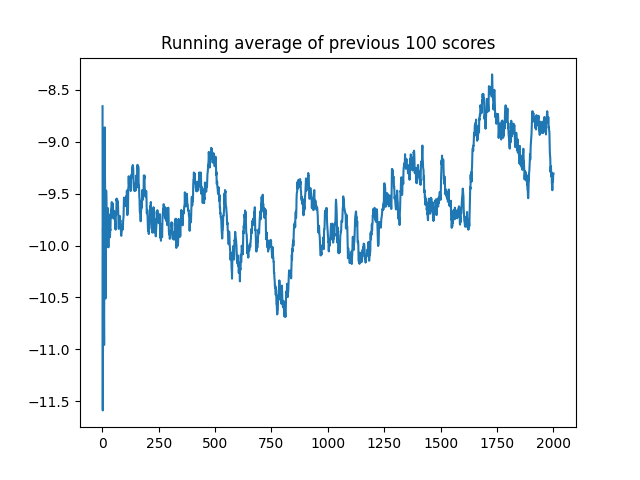

# robotics-tutorial

This repo have the most detailed codes and comments of how to code RL algorithms. And it provide codes to train the robotic arms in gymnasuim-robotics which can't be found in any tutorial on the Internet
Key features:

- the clear code style
- detailed comments
- easy to run and no mistakes

## file structure

- notebook: the basic RL algorithms to train the simple env: CartPole
- atari_game: the DQN network to train the atari games
- robotics: the most contribution of my repo, using different methods to train the robotics arms

## Atari Games (DQN)

## Robotic Arm Task (Soft-Actor-Critic)

